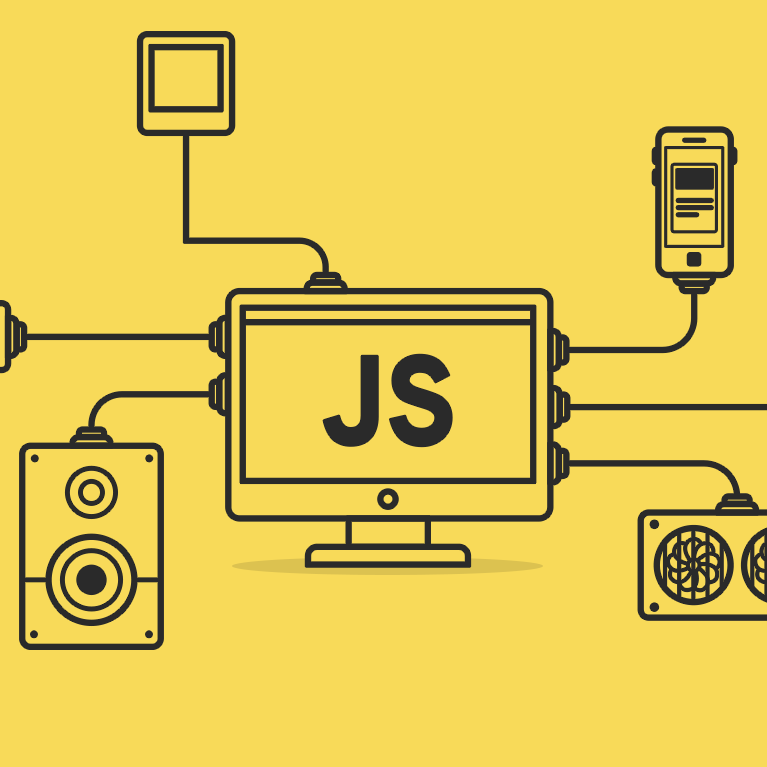

JavaScript was the first computer language that I learned when I attend to ICS course. Therefore, it is comfortable language than other programming languages because it is my primary language. However, I learned various fundamental programming concepts of JavaScript by using a FreeCodeCamp in my ICS314 Software Engineering course. The basic structures of JavaScript and working with an array, objects, functions, loops, and if/else statements were not a new concept, but  ECMAScript was brand new material that I did not encounter before. The features such as let, arrow function in JavaScript, and promises were very new to me, and I was glad to learn new features about JavaScript.

Some people say JavaScript is not a good programming language. However, I think that JavaScript is a good programming language from a software engineering perspective. It is because JavaScript makes people easy to adopt a new language through transpilation and polyfill. There are many advantages when a programmer can adopt a new language as a software engineer, and this is the reason why I think JavaScript is a good programming language.

In my ICS314 class, our classmates suppose to do WODs(workout of the day) as a group and as an individual. We have to set up the timer and work on the code within the prescribed time. This style of learning involved critical thinking because I have to prepare for the WODs, and it makes me think about how to tackle the problem. It basically tests my programming skills, but also how to use time wisely. I do enjoy WODs, but it is stressful at the same time. However, I am certainly aware that this strategy will develop my programming skills more powerful.
