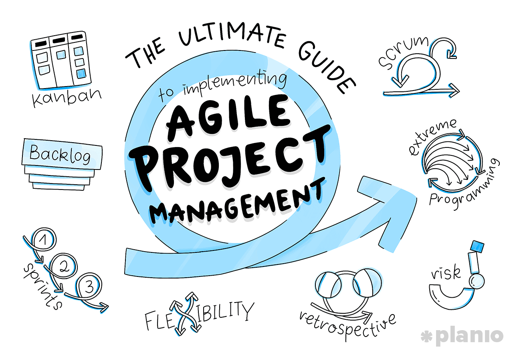

The journey of 16 weeks of software engineering was fleeting yet everlasting. I have learned numerous techniques from the course within a few months. The past few weeks were joyful and stressful at the same time, but I can definitely say that it was a valuable semester. The two fundamental software engineering concepts that stood out at this point are ethics in software engineering and agile project management. It's not only because those two were the last things that I learned from the class but they also had a great impact on me.

## Ethics?

I did not realize that ethics are deeply involved in software engineering until a few weeks ago. All I cared about was programming and coding but never thought beyond it. The ACM code of ethics and professional conduct was very new to me. It was interesting to understand why <a href="https://www.acm.org/code-of-ethics">"the Code" is significant to all computing professionals. **Not being harmful**. It is a simple context but has a lot of meaning to it. What if the consequences were amplified online hate and failed to protect young people from harmful content? Yes, it did not avoid the harm and means it is unethical. Finally, I can see how some people or companies violate the code of ethics, resulting in a harmful impact on society. The programmers should accept and be subject to the code of ethics and must behave ethically. It is because we all have the responsibility of our work and have to support the public good.

## Agile Project Management?

I have confidence in saying coding is everything about teamwork. Communicating and planning the project plays a significant role because most computer professionals work as a team. I participated in the first team project in my life for the last few weeks. It was for the final project, and I cannot think of finishing it without agile project management. It was an impressive technique that brought up our progress effectively. Agile project management is breaking a project into several milestones and track with GitHub. We divided the tasks in the project board by three milestones. Our teammates had to tackle the issues in each milestone, and this was very helpful to manage our plan. We can simply see who is doing what task, and easy to look over their progress in a certain branch they created. Agile project management provided a great opportunity to experience how real-world teamwork is going to be. I became very confident in bonding as a team and how to manage a team project effectively.

## Overall

It was not an easy class, but it was full of interesting materials that I really enjoyed. Also, those materials are going to be very helpful when I get into my future career. Now I know how to act ethically, and I know how to manage the project effectively as a team. As I stated above, it was a valuable semester about learning software engineering beyond how to develop software.

