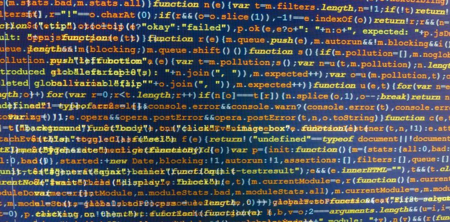

## Coding Standard?

Some might think why the coding standard is important, as I did before. Once I believed good coding means when my code runs without any bug. I never considered coding standards when I wrote my code in past ICS courses. Although, I did not write my code in one line as the image that I added above. I am a newbie in IntelliJ IDE and recently started to use ESLint to check my code. Is it stressful to using ESLint? I would say no. It is because ESLint automatically corrects my coding, and there are not many things that I have to do manually.

In my ICS314 course, I finally learned and discovered why the coding standard is important to programmers. The coding standard makes it easy to read and it ensures our codes look readable. It was the basics of coding. People must read our code and understand it without questioning. Programming has a close relation with teamwork because mostly programmers work together as a team. We must provide readable code to our teammates, and work through the process without lagging behind by understanding the code.

## ESLint

ESLint, ECMA Script, was the new concept in my programming life. I usually corrected my code with inbuilt tool in IDE, but sometimes I ignored the yellow line underneath my code saying "fix it". I did not spend time on my coding style, because my code did run without any bug. However, using ESLint changed my coding style whole differently. It automatically checks my code and fixing through ESLint is not time consuming. I can see what is the problem by moving my cursor on the red lightbulb. I feel more confident with my code when I see the green checkmark on the top of my project. It implements my code to look organized and readable, and it truly do their job.

Overall, downloading and installing the ESLint files are a bit troublesome, but it has a great opportunity beyond that. It will be more difficult and tedious to correct my various lines of code without using ESLint. In my perspective, using ESLint is very comfortable, and it is a pleasant tool that makes me more confident of my code.

