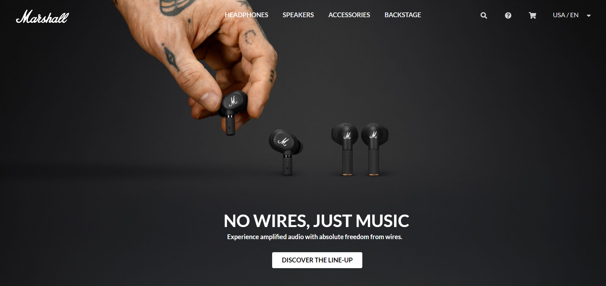

## Before Using a Semantic UI

My first HTML web page was junk. Literally, a junk. The margins, the paddings, the image size, the alignments were a mess, and I had no clue how to make it beautiful. For instance, if I fix my margins then other elements were getting uglier. What a shame. I had to stop working with my first HTML web page because I no longer want to look ugly page that I made.

## After Using a Semantic UI

Fortunately, and thankfully, there was a helper for me. **UI framework**. I did not have to mess around with my code anymore, because Semantic UI did everything for me. I was amazed when I first used Semantic UI. The most struggling part of HTML was placing the context in the exact place. I had to use margins and paddings to do that, but with UI, I could finish within a few words - class: "ui right item". It automatically places my element on the right side of my web page. It was a beautiful feature, that makes a beautiful web page.

After learning how to use the UI framework, there was no point in using raw HTML and CSS because the UI framework makes life easier. I do not have to spend time making the equal size of sections, menu bar, using an image as background, etc. Additionally, I could not find any problem with using a Semantic UI. The brief explanation and example codes on the [Semantic UI](https://semantic-ui.com/) were very helpful. Now I cannot imagine designing a web page without Semantic UI. It is a powerful and wonderful tool to make my ugly page into a beautiful-looking page.

## Examples

The above screenshot was the first web page that I made without a Semantic UI. I had a hard time overlapping the text on the image. Also, I could not make a margin between the photos which made my web page ugly.

The above screenshot was the web page with Semantic UI that I recreated [Marshall Headphones](https://www.marshallheadphones.com/us/en/). It looks beautiful with the automatic margins by containers, the legible menu bar at the top with icons on the right.

Recreating the Marshall web page was easier and took less time than the first one. Therefore, I cannot think of any reason why to use raw HTML and CSS.

