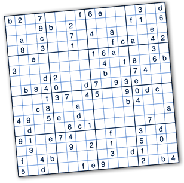

In my ICS211 course, I was tasked to implement a recursive method to find the solution to 16x16 Hexadecimal Sudoku. Professor Moore provided a format of the Sudoku code, and our classmates had to complete the code that was provided. The implemented Hexadecimal Sudoku was a 16x16 grid of integers with values of 0 to F. The valid answer for the Sudoku problem was it must have only one of 0 to F values without any duplicates among each row, each column, and each 4x4 grid. The recursive method to find the valid solution of the sudoku was the following:


  1. If all cells are filled, see if this Sudoku is valid. If it is valid, we have found a solution. If not, this Sudoku is not a solution. [Base case 1].
  2. If at least one cell is not filled, see what values are legal for this cell.


The algorithm of this assignment was an example of **backtracking**. The code tries to search for a valid value from a starting point, and it returns to the starting point if it cannot find any valid value. This recursion method keeps running until all the values have been tried and find a different option.


Here is one example of my implentmention for the project, which to check Sudoku is solved or not:
```js
  public static boolean solveSudoku(int[][] sudoku) {

    // check sudoku is solved, if it is not solved then loop
    if (checkSudoku(sudoku, false)) {
      // loop through the sudoku row and column
      for (int row = 0; row < sudoku.length; row++) {
        for (int column = 0; column < sudoku.length; column++) {
          // if sudoku has a empty space then return fillCell method
          if (sudoku[row][column] == -1) {
            return fillCell(sudoku, row, column);
          }
        }
      }
    }
    return checkSudoku(sudoku, false);
  }
```

View code: <a href="https://github.com/cathy-kim95/Hexadeciaml-Sudoku"> Hexadeciaml-Sudoku


  
  
