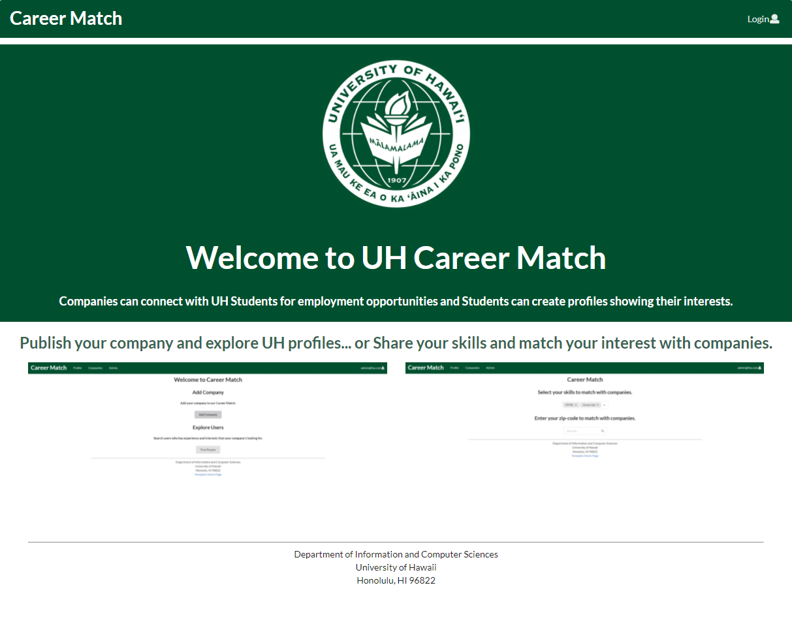

In my software engineering course, I was tasked to implement a website using meteor and MongoDB to create a website that provides an opportunity for UH Manoa students. My teammates and I implemented a website called Career Match that provides a new way for connecting companies with a matching system. Students can select their skills to match with companies, and recruiters can also use the app to explore student profiles with interests through Career Match.


We used different collections of MongoDB to track and browse the profiles by interest. Here is one example of the code to browsing the interest of profiles:
```js
      const allInterestsofCompany = _.pluck(CompanyInterest.collection.find().fetch(), 'interest');
      const allInterests = _.uniq(allInterestsofCompany);
      const formSchema = makeSchema(allInterests);
      const bridge = new SimpleSchema2Bridge(formSchema);
      const interestNames = _.pluck(CompanyInterest.collection.find({ interest: { $in: this.state.interest } }).fetch(), 'name');
      const companyData = _.uniq(interestNames).map(name => getCompanyData(name));
      const companyEmails = _.pluck(Company.collection.find().fetch(), 'email');
      const companyProfiles = companyEmails.map(name => getCompanyData(name));
```


Our team used agile project management throughout the project. This technique minimized the coordination conflicts by creating different issues at different milestones and track with the GitHub project board. It was very helpful to manage our plan by simply looking over our progress in a certain branch. We also used Digital Ocean to deploy our website. Therefore, every user can visit our website to check out without installing a meteor on the local server.


View code: <a href="https://github.com/career-match/career-match">
Career Match </a>
View organization: <a href="https://career-match.github.io/"> Career Match organization’s GitHub Page </a>


  
  
