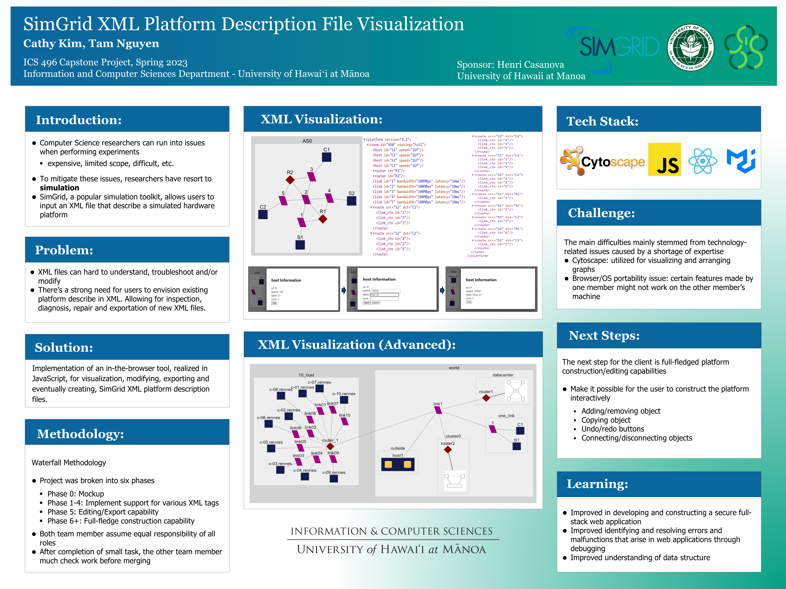
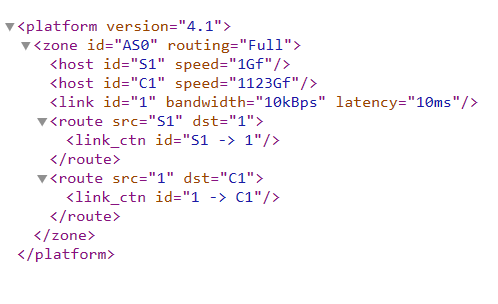
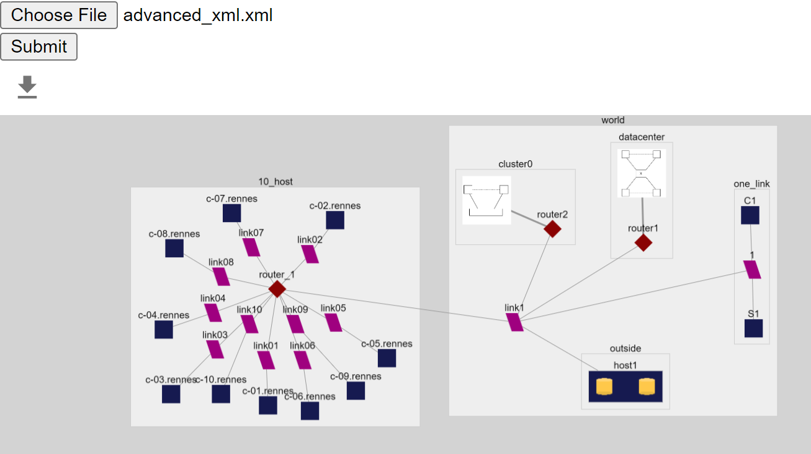

For my capstone project, I collaborated with a partner to address a common challenge faced by Computer Science researchers when conducting experiments. Many researchers encounter difficulties during experimentation, often resorting to simulation tools like SimGrid. SimGrid facilitates experimentation by allowing users to input XML files describing simulated hardware platforms.

To streamline this process and enhance usability, we developed an innovative solution—an in-the-browser tool created using JavaScript. This tool enables researchers to visualize, modify, export, and even generate SimGrid XML platform description files directly within their web browsers.



The image above illustrates a simplified example of an XML file. However, envision a scenario where the XML file comprises thousands of lines of code. In response to this challenge, my partner and I developed an application to facilitate the visualization of such XML files, as depicted below:



Here is one example of my implementation for the project, managing the popups for node descriptions and edited the XML file:
```js
export default function PopUp({ obj, open, close, handleElements }) {
    const [editedObj, setEditedObj] = useState(obj);
    const [editing, setEditing] = useState(false);

    // avoid for box disselection and cursor disappearance
    const inputRef = useRef(null);

    // Setting the edited object to its key
    const handleEdit = (key, value) => {
        setEditedObj({
            ...editedObj,
            [key]: value
        });
    };
    
    ...

    // if data.id === editedObj.id, save the new value
    const handleSave = () => {
        handleElements(prevElements => {
            return prevElements.map(el => {
                if (el.data.id === editedObj.id) {
                    return {
                        ...el,
                        data: {
                            ...el.data,
                            ...editedObj
                        }
                    };
                }
                return el;
            });
        });
        close();
        setEditing(false);
    };
    
    ...

    return (
        <div>
            {Object.entries(newObj).map(([key, val]) => (
                <div key={key}>
                    <label htmlFor={key}>{key}: </label>
                    {key === "id" ? (
                        <span>{val}</span>
                    ) : !editing ? (
                        <span>{val}</span>
                    ) : (
                        <input
                            id={key}
                            type="text"
                            defaultValue={editedObj[key]}
                            onBlur={(e) => handleEdit(key, e.target.value)}
                            ref={inputRef}
                        />
                    )}
                </div>
            ))}
        </div>
    );
};
```

**Key Contributions:**

* Led the development and implementation of a full-stack web application using JavaScript.
* Enhanced user experience by enabling visualization and manipulation of XML files in the browser.
* Collaborated closely with a partner throughout all stages of the project, from conception to implementation.

**Achievements:**

* Enhanced proficiency in constructing secure full-stack web applications.
* Strengthened skills in identifying and rectifying errors and malfunctions within web applications through thorough debugging practices.
* Deepened understanding of complex data structures through practical application in the project.


View code: <a href="https://github.com/wrench-project/simgrid-platform-file-visualizer">
Simgrid XML Platform Description File Visualizer </a>


  
  
