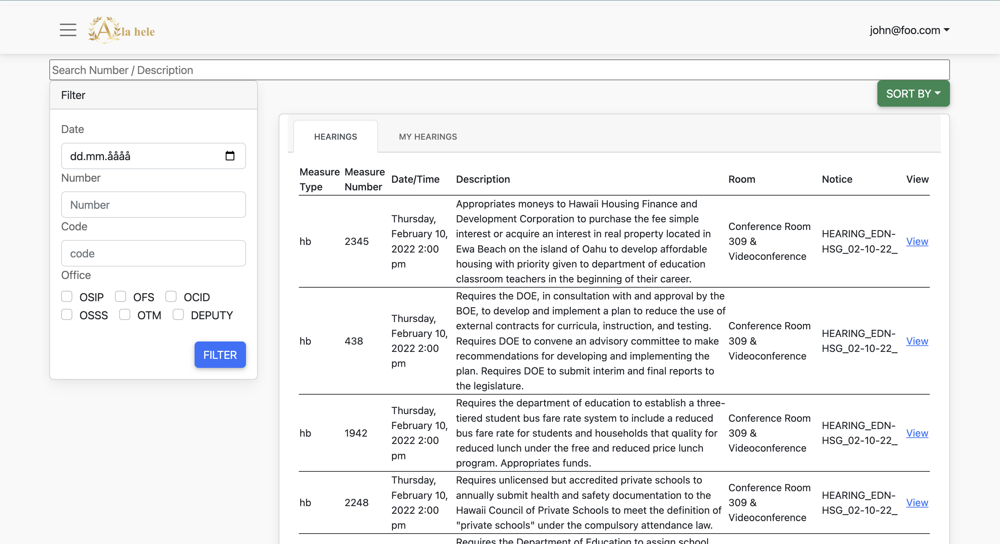

In my ICS314 course, I undertook the creation of a robust website using the Meteor Framework and JavaScript to support the Hawaii Department of Education in streamlining their state legislature process. I developed a comprehensive platform that enables real-time tracking of legislative measures, automated notifications, and efficient document creation and updating. The purpose of this project was to provide a tool that facilitates the passing of state legislature by offering features such as:

* Real-time tracking of legislative measures.
* Automated notifications to relevant personnel when action is required.
* Task automation for document creation and updating.
* Advanced search functionality by key parameters and keywords.
* Document versioning to track changes and enable easy comparison of different versions.

By creating this application, I aimed to streamline the legislative process and prevent measures from accidentally being retired due to disorganization or miscommunication.



Here is one example of my implementation for the project, which searches the certain document from many files:
```js
 const SearchBar = () => {
    const [search, setSearch] = useState('');
    const onChange = (e) => {
        setSearch(e.target.value);
    };

    const { ready, measures } = useTracker(() => {
        // Note that this subscription will get cleaned up
        // when your component is unmounted or deps change.
        // Get access to Stuff documents.
        const subscription = Measures.subscribeMeasures();
        // Determine if the subscription is ready
        const rdy = subscription.ready();
        // Get the Stuff documents
        const measuresItems = Measures.find({}, { sort: { name: 1 } }).fetch();
        return {
            measures: measuresItems,
            ready: rdy,
        };
    }, []);

    if (search === '') {
        return <input className="inputSearch" placeholder="Search Title / Code" type="text" value={search} onChange={onChange} />;
    }

    const filterTitle = measures.filter((p) => p.measureTitle.toLocaleLowerCase().includes(search.toLocaleLowerCase()));
    const filterCode = measures.filter((p) => p.code.toLocaleLowerCase().includes(search.toLocaleLowerCase()));
    const filterDescription = measures.filter((p) => p.description.toLocaleLowerCase().includes(search.toLocaleLowerCase()));
  }
```

View code: <a href="https://github.com/alahele/alahele">
Ala Hele </a>
View organization: <a href="https://alahele.github.io/"> Ala Hele organization’s GitHub Page </a>


  
  
